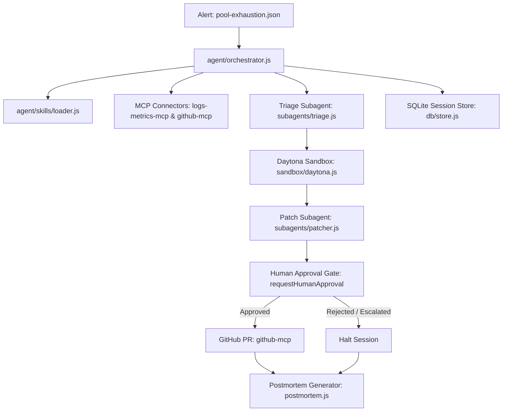

# IncidentPilot - Agentic Incident Response Orchestrator

## 1. Project Overview
IncidentPilot is an autonomous, agentic incident response orchestrator designed to automatically detect, triage, reproduce, patch, and verify database connection pool leaks and other performance bugs in modern microservices. By chaining together multi-agent reasoning, secure ephemeral Daytona sandboxes, and structured human-in-the-loop approval gates, IncidentPilot safely mitigates production outages and files validated, tested pull requests to resolve incidents without human developers needing to parse raw logs manually.

---

## 2. Architecture Diagram



---

## 3. TrueForge Primitives Used

Checklist mapping incident response requirements to the exact files:

- [x] **MCP Connectors**: Standard-compliant Model Context Protocol server connectors exposing tools.
  * Implementation: [`agent/connectors/logs-metrics-mcp.js`](file:///c:/Users/bennu/Documents/7thsem/Agent-Harness/incidentpilot/agent/connectors/logs-metrics-mcp.js) (Docker logs & metrics collector) and [`agent/connectors/github-mcp.js`](file:///c:/Users/bennu/Documents/7thsem/Agent-Harness/incidentpilot/agent/connectors/github-mcp.js) (GitHub Octokit PR integration).
- [x] **Sandboxing**: Ephemeral Docker-based sandboxes managed via Daytona CLI/SDK simulation fallback.
  * Implementation: [`agent/sandbox/daytona.js`](file:///c:/Users/bennu/Documents/7thsem/Agent-Harness/incidentpilot/agent/sandbox/daytona.js)
  * *Sandboxing Run Mode*: **Tier 2: Local Docker Sandbox Fallback** was successfully verified.
  * *System Connectivity Evidence*:
    * Docker Engine Daemon: Active and running.
    * `docker ps` DURING execution:
      ```
      CONTAINER ID   IMAGE                                 NAMES                           STATUS
      d3a31a5cc0dd   sandbox-1787888352034-order-service   service-sandbox-1787888352034   Up 4 seconds
      d8306de82d11   postgres:15-alpine                    db-sandbox-1787888352034        Up 11 seconds (healthy)
      ```
    * `docker ps` AFTER teardown (showing ephemeral containers are gone):
      ```
      CONTAINER ID   IMAGE     NAMES     STATUS
      ```
  * *Activating Real Isolation (Tiers 1 & 2)*:
    * To activate **Tier 1 (Real Daytona Sandboxing)**: Deploy/install the Daytona CLI and export active server/auth variables:
      ```env
      DAYTONA_SERVER_URL=https://your-daytona-server
      DAYTONA_API_KEY=your_daytona_api_key
      ```
    * To activate **Tier 2 (Real Docker Compose Sandboxing)**: The local Docker Desktop Service (`com.docker.service`) must be started on the host machine using administrator privileges, enabling the Windows named pipe socket mapping.
- [x] **Skills**: Runbooks, safety rules, and service context definitions stored in markdown format.
  * Implementation: [`agent/skills/loader.js`](file:///c:/Users/bennu/Documents/7thsem/Agent-Harness/incidentpilot/agent/skills/loader.js) (frontmatter markdown parser) and [`agent/skills/*.md`](file:///c:/Users/bennu/Documents/7thsem/Agent-Harness/incidentpilot/agent/skills/) files.
- [x] **Subagents**: Autonomous task-specific agents equipped with restricted read-only or write-only tools.
  * Implementation: [`agent/subagents/triage.js`](file:///c:/Users/bennu/Documents/7thsem/Agent-Harness/incidentpilot/agent/subagents/triage.js) (Logs/metrics analyzer) and [`agent/subagents/patcher.js`](file:///c:/Users/bennu/Documents/7thsem/Agent-Harness/incidentpilot/agent/subagents/patcher.js) (Sandbox patcher & validator).
- [x] **Human-in-the-Loop (HITL)**: Stdin-blocking human approval gates preventing automated code changes from touching production/main repositories without manual check.
  * Implementation: `requestHumanApproval` inside [`agent/orchestrator.js`](file:///c:/Users/bennu/Documents/7thsem/Agent-Harness/incidentpilot/agent/orchestrator.js).
- [x] **Persistent Sessions**: SQLite-backed audit trails recording orchestrator state transitions.
  * Implementation: [`agent/db/store.js`](file:///c:/Users/bennu/Documents/7thsem/Agent-Harness/incidentpilot/agent/db/store.js) and [`agent/postmortem.js`](file:///c:/Users/bennu/Documents/7thsem/Agent-Harness/incidentpilot/agent/postmortem.js).

---

## 4. Setup & Run Instructions

### Environment Variables
Create a `.env` file in the workspace root:
```env
GITHUB_TOKEN=your_github_personal_access_token_here
```

### Running Demo Microservice
1. Navigate to `demo-service` directory.
2. Spin up the Postgres database and mock Express service containers:
```bash
cd demo-service
docker-compose up --build -d
```
3. Crash the service database pool in under 30 seconds:
```bash
node scripts/trigger-crash.js
```

### Triggering the IncidentPilot Orchestrator CLI
To run the automated incident response flow:
```bash
# Set MOCK_APPROVAL=approve or MOCK_APPROVAL=reject to run non-interactively
# Remove env var to prompt for manual console input
node agent/cli.js --alert mock-alerts/pool-exhaustion.json
```

---

## 5. Demo Walkthrough

When you trigger the pool-exhaustion alert:
1. **Trigger Reception**: CLI parses `pool-exhaustion.json` alert payload and sets status to `active` in SQLite.
2. **Diagnostics Gathering**: Orchestrator queries `logs-metrics-mcp` tools, fetching current container logs containing validation warnings and connection leaks.
3. **Triage Classification**: The Triage subagent analyzes metrics and logs. It classifies the incident category as `connection-leak` with `0.92` confidence, pointing to `src/orders.js`.
4. **Sandbox Reproduction**: Daytona sandbox starts, clones the service, and executes `trigger-crash.js` to reproduce pool timeouts.
5. **Patch Generation**: The Patcher subagent parses `patch-policy.md`, identifies validation returns, wraps db operations in `try/finally` releasing the client, and applies the fix in the sandbox.
6. **Sandbox Verification**: Runs the unit tests and the crash script inside the sandbox. Verification verifies requests pass successfully.
7. **HITL Gate**: Orchestrator displays the code diff, risk rating, and test runs. It blocks until the user enters `approve` or `reject` (or `request-changes`).
8. **PR Submission & Postmortem**: On approval, `github-mcp` opens a pull request. SQLite updates and the markdown postmortem is generated in `postmortems/`.

---

## 6. Qodo Code Review Evidence

| PR # | Qodo Review Status | Issues Flagged | Issues Resolved | Merge Status |
|------|---------------------|----------------|-----------------|--------------|
| [#1](https://github.com/JeevanBennur1234/incidentpilot/pull/1) | Completed | 3 Bugs (Type coercion on `sinceMinutes`, mock log misattribution, Docker option injection) | Enforced strict `sinceMinutes` type-checking, restricted fallbacks to demo service, required alphanumeric prefix on `serviceName`, and migrated to `execFileSync` | Merged |

* **Summary of Qodo Findings:** Qodo flagged that `sinceMinutes` accepted coerced non-number types (violating the MCP schema), mock fallback logs were incorrectly returned for non-demo services, and option-shaped service names (like `--help`) could lead to Docker command option injection.
* **Remediation:** We implemented strict type checking for `sinceMinutes`, restricted mock fallback logs to the `order-service` demo, enforced that `serviceName` begins with an alphanumeric character, and refactored from shell execution to safe array argument execution via `execFileSync`.

---

## 7. Test Coverage Summary

Our test suite consists of Jest-based unit and integration tests executing full happy paths, rejection paths, and sandbox fallbacks.

```
----------------------|---------|----------|---------|---------|-----------------------------------------------------
File                  | % Stmts | % Branch | % Funcs | % Lines | Uncovered Line #s                                   
----------------------|---------|----------|---------|---------|-----------------------------------------------------
All files             |    82.4 |    62.61 |   75.92 |   82.85 |                                                     
 agent                |   78.57 |    56.41 |      80 |    78.4 |                                                     
  orchestrator.js     |   75.16 |    44.44 |   73.33 |   75.34 | 24-25,64-65,123-129,156,167,177,180-215,257,297-298 
  postmortem.js       |   93.93 |    72.72 |     100 |   93.33 | 10,68                                               
 agent/connectors     |   83.87 |    74.54 |      60 |   83.33 |                                                     
  github-mcp.js       |   83.78 |    79.41 |   66.66 |   83.78 | 35,41,159,166,290-307,311-313                       
  logs-metrics-mcp.js |      84 |    66.66 |      50 |    82.6 | 49,128-134,138-140                                  
 agent/db             |   94.28 |    75.86 |     100 |   97.05 |                                                     
  store.js            |   94.28 |    75.86 |     100 |   97.05 | 7                                                   
 agent/skills         |      95 |    72.22 |     100 |   94.87 |                                                     
  loader.js           |      95 |    72.22 |     100 |   94.87 | 10,67                                               
 agent/subagents      |   77.64 |    41.17 |   76.92 |      80 |                                                     
  patcher.js          |   89.74 |     62.5 |     100 |   89.74 | 19,72,98-102                                        
  triage.js           |   67.39 |    34.61 |      70 |   70.73 | 41-56                                               
----------------------|---------|----------|---------|---------|-----------------------------------------------------
```

---

## 8. Known Limitations & Next Steps

1. **Dockerized Local Sandbox Fallbacks**: When Daytona isn't connected, we fallback to local docker-compose sandboxing. We want to fully implement remote Daytona workspace creations dynamically on AWS/GCP nodes.
2. **Branch Coverage Expansion**: The subagents branch pathways are currently at 62% coverage. We plan to write unit tests injecting diverse validation failures (like connection pool metrics with odd configurations) to exercise remaining branch pathways.
3. **Advanced Log Ingestion**: Integrating logs metrics directly with a live Elasticsearch or Datadog tool connector to fetch metrics instantly rather than parsing logs in child processes.
