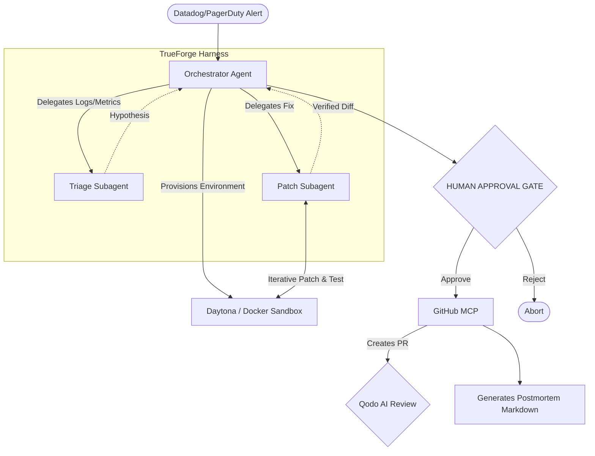

# IncidentPilot 🚨

**The Autonomous Incident Response & Postmortem Agent**

Built for [The Agent Harness Hackathon](https://www.wemakedevs.org/hackathons/trueforge) by WeMakeDevs.

## The Problem
When a production service goes down, engineers lose critical time manually pulling logs, reproducing the issue locally, figuring out the root cause, testing a patch, and writing postmortems.

## The Solution (IncidentPilot)
IncidentPilot is an autonomous agent built on the **TrueForge agent harness** that acts as your robotic Site Reliability Engineer (SRE). When an alert fires, IncidentPilot:
1. **Triages** the production alert via Log/Metric MCPs.
2. **Reproduces** the crash in a secure **Daytona Sandbox**.
3. **Delegates** patching and testing to specialized subagents.
4. **Stops before doing damage**: It strictly requires a **Human Approval Gate** before pushing code.
5. **Resolves**: Opens a GitHub Pull Request and automatically generates a detailed incident postmortem.

---

## 🏗️ Architecture & Agent Harness (TrueForge)

IncidentPilot leverages **TrueForge** as its core agent harness to orchestrate complex multi-agent workflows while maintaining strict boundaries.



### 🛡️ License to Act (But Safely)
This project explicitly fulfills the hackathon's core challenge:
* **Reaches Tools:** Communicates with GitHub APIs and custom Log/Metric MCP servers.
* **Runs Code Safely:** Provisions isolated Daytona/Docker sandboxes to safely compile and run `npm test` on generated code before ever showing it to a human.
* **Stops Before Doing Damage:** The Orchestrator halts execution entirely to present a "CVE-Equivalent Risk Summary" and diff. It cannot merge or deploy without an explicit `approve` command from a human SRE.

---

## 🚀 Setup and Installation

### Prerequisites
* Node.js (v18+)
* A GitHub Fine-Grained Personal Access Token (with Repo Read/Write & Pull Request permissions)
* Docker (Optional, for local sandbox execution)

### 1. Environment Configuration
Clone the repository and install dependencies:
```bash
git clone https://github.com/Shashidhar-Pawadashetti/incidentpilot.git
cd incidentpilot
npm install
```

Create a `.env` file in the root directory:
```env
PORT=3000
NODE_ENV=development
GITHUB_TOKEN=your_github_pat_here
```
*(Note: If you want to run a dry-run simulation without touching a real GitHub repo, set `GITHUB_TOKEN=your_github_token_here` and the CLI will emulate the GitHub API).*

### 2. Run the Orchestrator
Trigger an incident simulation using a mock pool-exhaustion alert:
```bash
node agent/cli.js --alert mock-alerts/pool-exhaustion.json
```

Watch as TrueForge spawns subagents, analyzes the logs, patches the code, verifies it in the sandbox, and prompts you for approval!

---

## 🤖 Qodo Code Review Integration

Every Pull Request generated by IncidentPilot is automatically reviewed by **Qodo** before merging. This ensures that the AI-generated patch adheres to best practices and doesn't introduce secondary regressions.

*(Hackathon Judges: See our Pull Requests tab for live examples of Qodo reviewing IncidentPilot's automated PRs!)*

**Example Qodo Review Workflow:**
1. IncidentPilot opens a PR to fix `db-connection-leak` (See our live proof: [PR #6 with Qodo Review](https://github.com/Shashidhar-Pawadashetti/incidentpilot/pull/6)).
2. Qodo app analyzes the diff and leaves a comprehensive code review.
3. The human SRE reviews both the Agent's Sandbox Test Report and Qodo's architectural feedback before clicking merge.

---

## 📂 Project Structure
* `/agent/` - The TrueForge Orchestrator and core logic.
  * `/subagents/` - Specialized TrueForge subagents (Triage & Patcher).
  * `/sandbox/` - Daytona and Local Docker environment provisioning.
  * `/connectors/` - Custom MCP Servers (GitHub, Logs/Metrics).
* `/demo-service/` - A dummy Node.js service intentionally injected with bugs for the agent to fix.
* `/postmortems/` - Automatically generated markdown postmortems after incident resolution.

---
*Built with ❤️ for The Agent Harness Hackathon*
